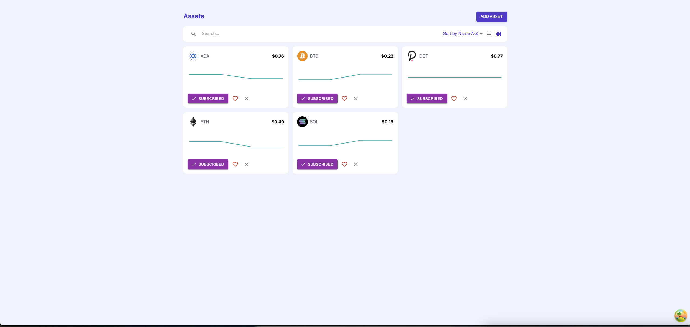
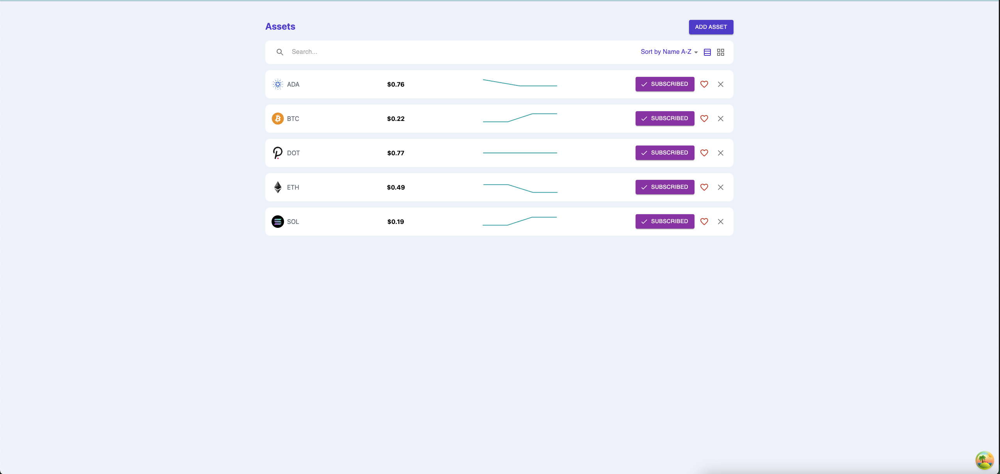

# Explanation:

this solution contains 3 microservices :

- zimzam -> act the api-gateway and also maintains the asset and priceRecord collection. send a message every 15 seconds to the price-fetcher to fetch the latest prices of each existing asset and send a message to the ws-zimzam whenever the price-fetcher sent new latest price for an asset
- ws-zimzam -> act the websocket server, update the client sockets whenever an asset been updated with new latest price
- price-fetcher -> act as the price fetcher server which fetch the latest price of an asset using the coinmarketcap API. update the zimzam project about a new latest price of an asset

# Additional notes:

- I didn't manage to within time to create a proper production environment using docker
- I decided to add a third service(price-fetcher) to separate the responsibility of fetching the latest price using coinmarketcap API
- the idea of the "subscribed" button on the app is to allow to "unsubscribe" from the web-sockets update for that token

# How to run this:

1. run the following commands: 
```code
   npx nx run-many --targets=build

```

2. run the mongo container using the docker-compose yaml

```code
   docker-compose up -d

```

3. on separate sessions run each of those commands for each service:
```code
   node dist/apps/zimzam/main.js

```

```code
   node dist/apps/ws-zimzam/main.js

```

```code
   node dist/apps/price-fetcher/main.js

```

# Screenshots




